# Laboratorio 2b: Administrar la gobernanza a través de Azure Policy

## Escenario de laboratorio
Para mejorar la administración de los recursos de Azure en Contoso, se le asignó la tarea de implementar la siguiente funcionalidad:

- Etiquetar grupos de recursos que incluyen solo recursos de infraestructura (como cuentas de almacenamiento de Cloud Shell)

- Garantizar que solo los recursos de infraestructura correctamente etiquetados se puedan agregar a los grupos de recursos de infraestructura

- Remediar cualquier recurso no conforme

**Nota:** Hay disponible una simulación de laboratorio interactiva que le permite hacer clic en este laboratorio a su propio ritmo. Es posible que encuentre ligeras diferencias entre la simulación interactiva y el laboratorio alojado, pero los conceptos e ideas centrales que se demuestran son los mismos.

## Objetivos
En este laboratorio, haremos lo siguiente:

- Tarea 1: crear y asignar etiquetas a través de Azure Portal
- Tarea 2: Hacer cumplir el etiquetado a través de una política de Azure
- Tarea 3: aplicar el etiquetado a través de una política de Azure

**Tiempo estimado: 30 minutos**

## Diagrama de arquitectura

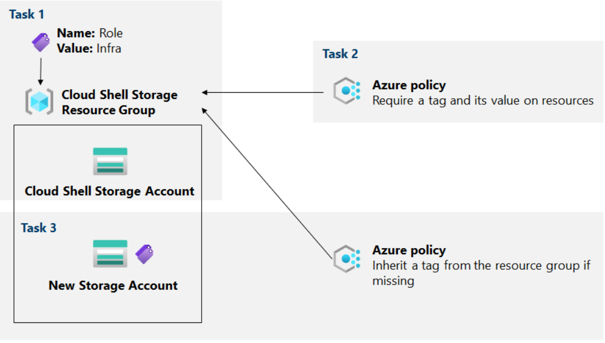

# Instrucciones
## Ejercicio 1
### Tarea 1: Asignar etiquetas a través de Azure Portal
En esta tarea, creará y asignará una etiqueta a un grupo de recursos de Azure a través de Azure Portal.

1. En Azure Portal, inicie una sesión de PowerShell dentro de Cloud Shell .

**Nota :** si es la primera vez que inicia Cloud Shell y aparece el mensaje No tiene almacenamiento montado , seleccione la suscripción que está usando en este laboratorio y haga clic en Crear almacenamiento .

2. En el panel de Cloud Shell, ejecute lo siguiente para identificar el nombre de la cuenta de almacenamiento que usa Cloud Shell:

```
df
```
3. En el resultado del comando, tenga en cuenta la primera parte de la ruta completa que designa el montaje de la unidad principal de Cloud Shell (marcado aquí como xxxxxxxxxxxxxx:

```
//xxxxxxxxxxxxxx.file.core.windows.net/cloudshell   (..)  /usr/csuser/clouddrive
```
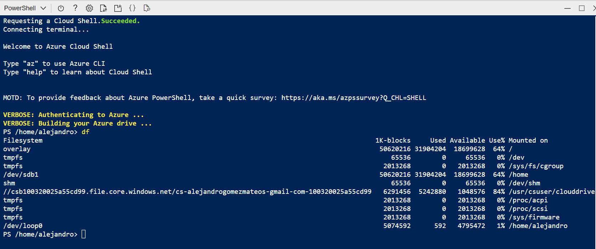

4. En Azure Portal, busque y seleccione Cuentas de almacenamiento y, en la lista de cuentas de almacenamiento, haga clic en la entrada que representa la cuenta de almacenamiento que identificó en el paso anterior.

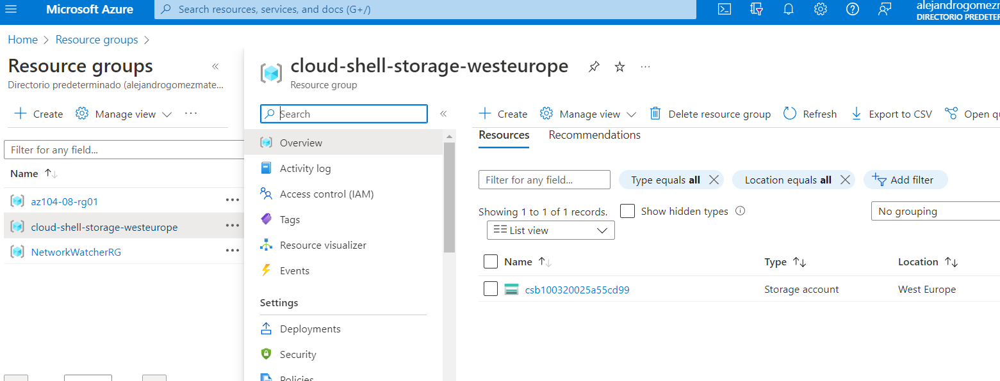

5. En la hoja de la cuenta de almacenamiento, haga clic en el vínculo que representa el nombre del grupo de recursos que contiene la cuenta de almacenamiento.

**Nota :** tenga en cuenta en qué grupo de recursos se encuentra la cuenta de almacenamiento, la necesitará más adelante en el laboratorio.

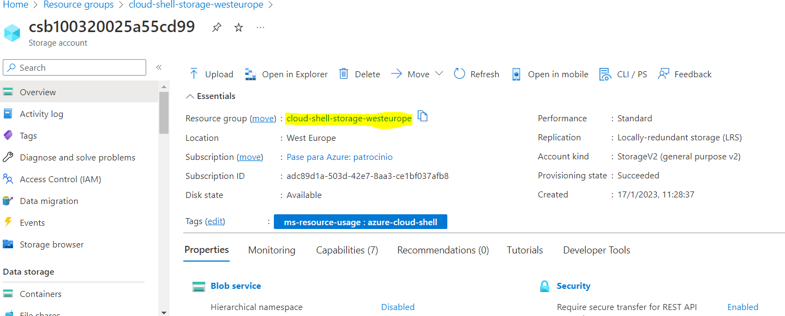

6. En la hoja del grupo de recursos, haga clic en Haga clic en editar junto a Etiquetas para crear nuevas etiquetas.

7. Cree una etiqueta con la siguiente configuración y aplique su cambio:

    | Configuración | Valor |
    | -- | -- |
    | Nombre | Role |
    | Valor | Infra |
    | | |

8. Vuelva a la hoja de la cuenta de almacenamiento. Revise la información de descripción general y tenga en cuenta que la nueva etiqueta no se asignó automáticamente a la cuenta de almacenamiento.

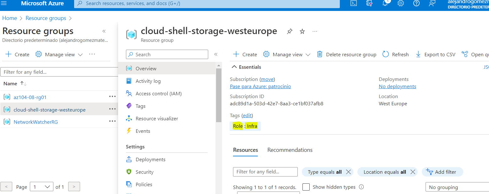

### Tarea 2: Hacer cumplir el etiquetado a través de una política de Azure
En esta tarea, asignará la política Requerir una etiqueta integrada y su valor en los recursos al grupo de recursos y evaluará el resultado.

1. En Azure Portal, busque y seleccione **Política** .

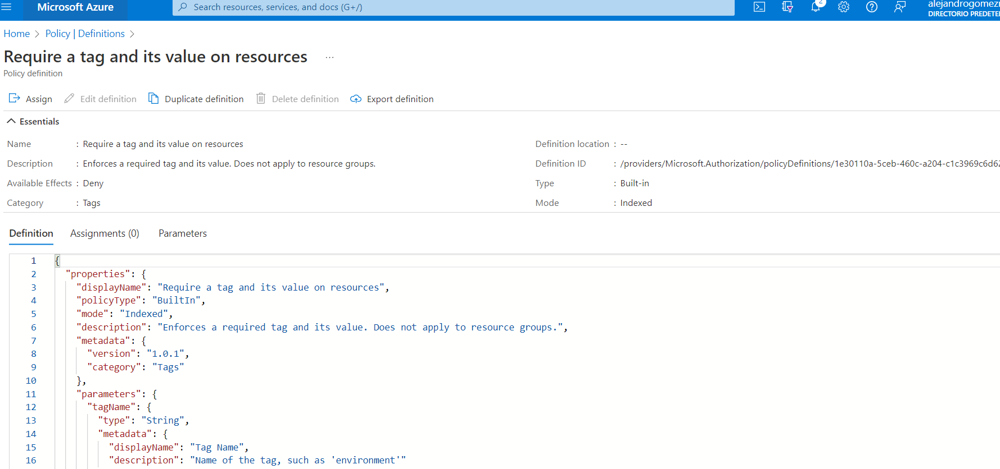

2. En la sección **Creación** , haga clic en **Definiciones** . Tómese un momento para examinar la lista de definiciones de políticas integradas que están disponibles para su uso. Enumere todas las políticas integradas que implican el uso de etiquetas seleccionando la entrada **Etiquetas** (y anulando la selección de todas las demás entradas) en la lista desplegable **Categoría** .

3. Haga clic en la entrada que representa la política integrada Requerir una etiqueta y su valor en los recursos y revise su definición.

4. En la hoja de definición de política integrada Requerir una etiqueta y su valor en los recursos , haga clic en Asignar .

5. Especifique el **Ámbito** haciendo clic en el botón de puntos suspensivos y seleccionando los siguientes valores:

    | Configuración | Valor |
    | -- | -- |
    | Suscripción |	el nombre de la suscripción de Azure que está utilizando en este laboratorio
    | Grupo de recursos | el nombre del grupo de recursos que contiene la cuenta de Cloud Shell que identificó en la tarea anterior |
    | | |

**Nota :** un ámbito determina los recursos o grupos de recursos en los que se aplica la asignación de políticas. Puede asignar políticas en el nivel de grupo de administración, suscripción o grupo de recursos. También tiene la opción de especificar exclusiones, como suscripciones individuales, grupos de recursos o recursos (según el alcance de la asignación).

6. Configure las propiedades básicas de la tarea especificando los siguientes ajustes (deje los demás con sus valores predeterminados):

    | Configuración	| Valor |
    | -- | -- |
    | Nombre de la asignación | Requerir etiqueta de rol con valor Infra |
    | Descripción | Requerir etiqueta de función con valor de infraestructura para todos los recursos en el grupo de recursos de Cloud Shell |
    | Politica de ACCION | Activado |
    | | |

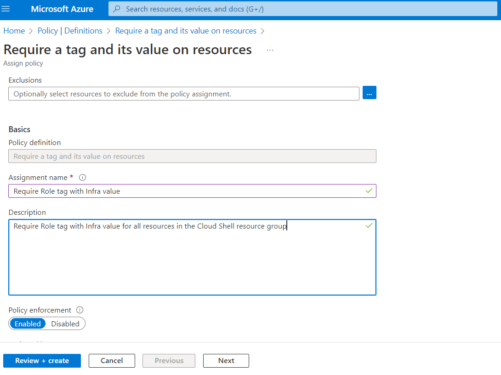

**Nota :** el nombre de la asignación se completa automáticamente con el nombre de la política que seleccionó, pero puede cambiarlo. También puede agregar una Descripción opcional . Asignado por se completa automáticamente en función del nombre de usuario que crea la asignación.

7. Haga clic en **Siguiente** dos veces y establezca los **Parámetros** en los siguientes valores:

    | Configuración	| Valor |
    | -- | -- |
    | Nombre de etiqueta | Role |
    | Valor de etiqueta | Infra |
    | | |

8. Haga clic en Siguiente y revise la pestaña Remediación . Deje la casilla de verificación Crear una identidad administrada sin marcar.

**Nota :** esta configuración se puede usar cuando la política o iniciativa incluye el efecto deploymentIfNotExists o Modify .

9. Haga clic en **Revisar + Crear** y luego haga clic en **Crear** .

**Nota :** ahora verificará que la nueva asignación de directiva esté vigente al intentar crear otra cuenta de Azure Storage en el grupo de recursos sin agregar explícitamente la etiqueta requerida.

**Nota :** La política puede tardar entre 5 y 15 minutos en surtir efecto.

10. Vuelva a la hoja del grupo de recursos que hospeda la cuenta de almacenamiento utilizada para la unidad principal de Cloud Shell, que identificó en la tarea anterior.

11. En la hoja del grupo de recursos, haga clic en + Crear y luego busque Cuenta de almacenamiento y haga clic en + Crear .

12. En la pestaña Aspectos básicos de la hoja Crear cuenta de almacenamiento , verifique que esté usando el grupo de recursos al que se aplicó la política y especifique la siguiente configuración (deje los demás con sus valores predeterminados), haga clic en Revisar y luego haga clic en Crear :

    | Configuración | Valor |
    | -- | -- |
    | Nombre de la cuenta de almacenamiento	cualquier combinación globalmente única de entre 3 y 24 letras minúsculas y dígitos, comenzando con una letra |
    | | |

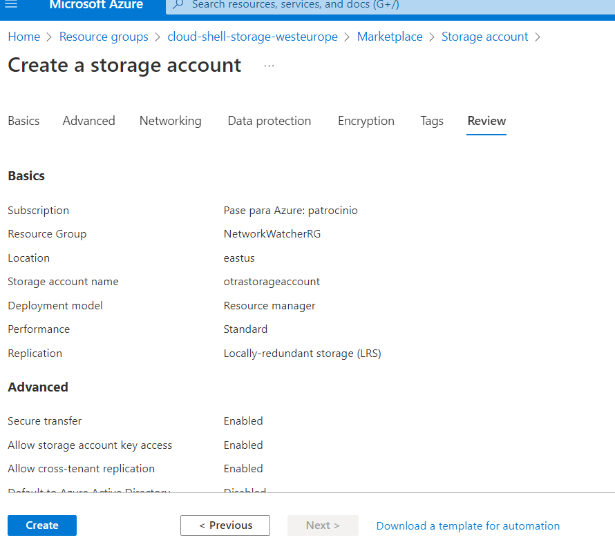

**Nota :** es posible que reciba un error de validación. Haga clic aquí para ver los detalles del error; Si es así, haga clic en el mensaje de error para identificar el motivo de la falla y omita el siguiente paso.

13. Una vez que cree la implementación, debería ver el mensaje **Error de implementación** en la lista de notificaciones del portal. En la lista de notificaciones , vaya a la descripción general de la implementación y haga clic en Error de implementación. Haga clic aquí para obtener detalles del mensaje para identificar el motivo de la falla.

**Nota :** Verifique si el mensaje de error indica que la política no permitió la implementación de recursos.

**Nota :** Al hacer clic en la pestaña **Error sin procesar** , puede encontrar más detalles sobre el error, incluido el nombre de la definición de rol Requerir etiqueta de rol con valor Infra . La implementación falló porque la cuenta de almacenamiento que intentó crear no tenía una etiqueta denominada Rol con su valor establecido en Infra .

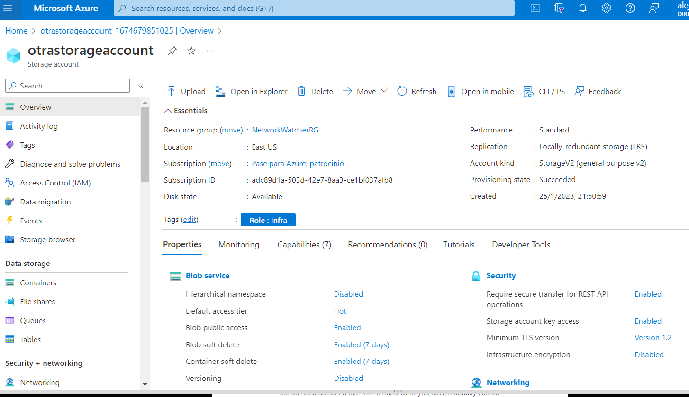

### Tarea 3: aplicar el etiquetado a través de una política de Azure
En esta tarea, usaremos una definición de política diferente para remediar cualquier recurso que no cumpla con los requisitos.

1. En Azure Portal, busque y seleccione **Política** .

2. En la sección Creación , haga clic en **Asignaciones** .

3. En la lista de asignaciones, haga clic en el icono de puntos suspensivos en la fila que representa la etiqueta **Requerir rol** con asignación de política de valor de infraestructura y use el elemento de menú Eliminar asignación para eliminar la asignación.

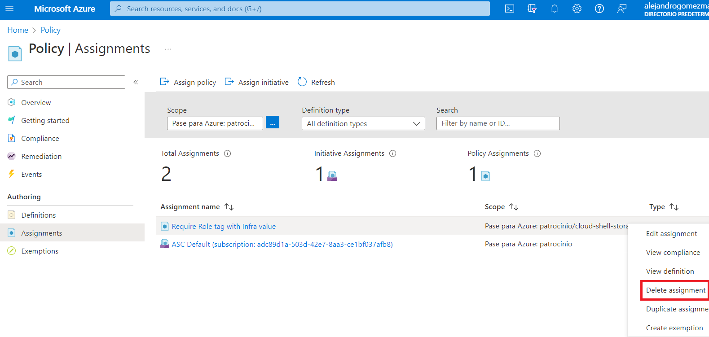

4. Haga clic en **Asignar política** y especifique el **Ámbito** haciendo clic en el botón de puntos suspensivos y seleccionando los siguientes valores:

    | Configuración | Valor |
    | -- | -- |
    | Suscripción | el nombre de la suscripción de Azure que está utilizando en este laboratorio |
    | Grupo de recursos | el nombre del grupo de recursos que contiene la cuenta de Cloud Shell que identificó en la primera tarea |
    | | |

5. Para especificar la definición de política , haga clic en el botón de puntos suspensivos y luego busque y seleccione Heredar una etiqueta del grupo de recursos si falta .

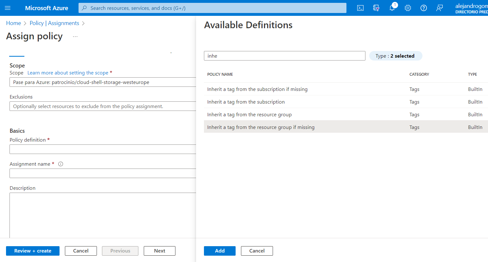

6. Configure las propiedades Básicas restantes de la tarea especificando las siguientes configuraciones (deje otras con sus valores predeterminados):

    | Configuración | Valor |
    | -- | -- |
    | Nombre de la asignación | Heredar la etiqueta de función y su valor de infraestructura del grupo de recursos de Cloud Shell si falta |
    | Descripción | Heredar la etiqueta de función y su valor de infraestructura del grupo de recursos de Cloud Shell si falta |
    | Politica de ACCION | Activado |
    | | |

7. Haga clic en Siguiente dos veces y establezca los **Parámetros** en los siguientes valores:

    | Configuración | Valor |
    | -- | -- |
    | Nombre de etiqueta | Role |
    | | |

8. Haga clic en Siguiente y, en la pestaña **Remediación** , configure los siguientes ajustes (deje los demás con sus valores predeterminados):

    | Configuración | Valor |
    | -- | -- |
    | Crear una tarea de corrección | activado |
    | Política para remediar | Heredar una etiqueta del grupo de recursos si falta |
    | | |

**Nota :** esta definición de política incluye el efecto Modificar .

9. Haga clic en **Revisar + Crear** y luego haga clic en **Crear** .

**Nota :** para verificar que la nueva asignación de directiva esté vigente, creará otra cuenta de Azure Storage en el mismo grupo de recursos sin agregar explícitamente la etiqueta requerida.

**Nota :** La política puede tardar entre 5 y 15 minutos en surtir efecto.

10. Vuelva a la hoja del grupo de recursos que aloja la cuenta de almacenamiento utilizada para la unidad principal de Cloud Shell, que identificó en la primera tarea.

11. En la hoja del grupo de recursos, haga clic en **+ Crear** y luego busque **Cuenta de almacenamiento** y haga clic en **+ Crear** .

12. En la pestaña Conceptos básicos de la hoja Crear cuenta de almacenamiento , verifique que esté usando el grupo de recursos al que se aplicó la política y especifique la siguiente configuración (deje los demás con sus valores predeterminados) y haga clic en Revisar :

    | Configuración	| Valor |
    | -- | -- |
    | Nombre de la cuenta de almacenamiento	| cualquier combinación globalmente única de entre 3 y 24 letras minúsculas y dígitos, comenzando con una letra |
    | | |

13. Verifica que esta vez haya pasado la validación y haz clic en **Crear** .

14. Una vez que se aprovisiona la nueva cuenta de almacenamiento, haga clic en el botón Ir al recurso y, en la hoja Información general de la cuenta de almacenamiento recién creada, observe que la etiqueta Rol con el valor Infra se ha asignado automáticamente al recurso.

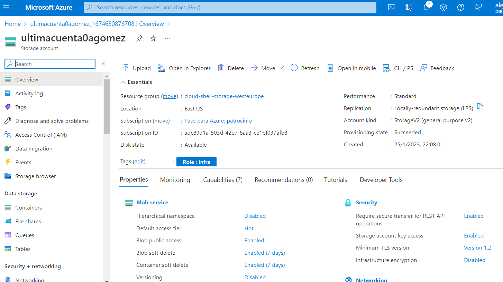

### Tarea 4: Limpiar recursos
**Nota :** Recuerde eliminar cualquier recurso de Azure recién creado que ya no use. La eliminación de los recursos no utilizados garantiza que no verá cargos inesperados, aunque tenga en cuenta que las políticas de Azure no generan costos adicionales.

**Nota :** no se preocupe si los recursos del laboratorio no se pueden eliminar de inmediato. A veces, los recursos tienen dependencias y tardan más en eliminarse. Supervisar el uso de recursos es una tarea común del administrador, así que revise periódicamente sus recursos en el Portal para ver cómo va la limpieza.

1. En el portal, busque y seleccione **Política** .

2. En la sección Autoría , haga clic en **Asignaciones** , haga clic en el ícono de puntos suspensivos a la derecha de la asignación que creó en la tarea anterior y haga clic en Eliminar asignación .

3. En el portal, busque y seleccione Cuentas de almacenamiento .

4. En la lista de cuentas de almacenamiento, seleccione el grupo de recursos correspondiente a la cuenta de almacenamiento que creó en la última tarea de este laboratorio. Seleccione Etiquetas y haga clic en **Eliminar** (Papelera a la derecha) en la etiqueta Rol:Infra y presione Aplicar .

5. Haga clic en Información general y haga clic en **Eliminar** en la parte superior de la hoja de la cuenta de almacenamiento. Cuando se le solicite la confirmación, en la hoja Eliminar cuenta de almacenamiento , escriba el nombre de la cuenta de almacenamiento para confirmar y haga clic en **Eliminar** .

**Revisar**
En este laboratorio, usted tiene:

Etiquetas creadas y asignadas a través de Azure Portal
Etiquetado obligatorio a través de una política de Azure
Etiquetado aplicado a través de una política de Azure
